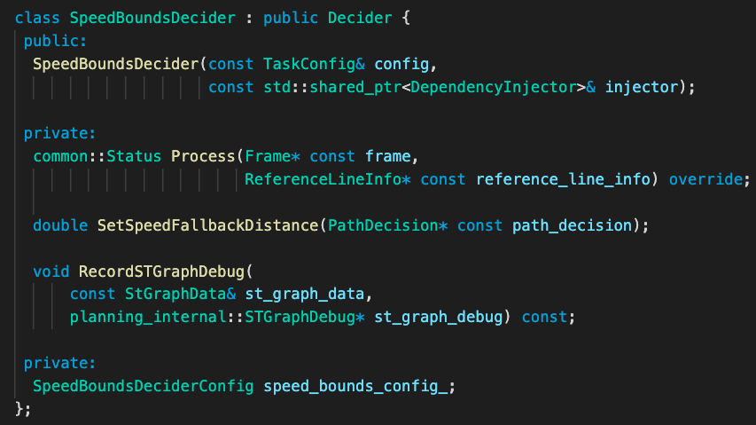

# Planning Speed Bounds Decider Introduction

_**Tip**: to read the equations in the document, you are recommended to use Chrome with [a plugin](https://chrome.google.com/webstore/detail/tex-all-the-things/cbimabofgmfdkicghcadidpemeenbffn) or copy the latex equation to [an online editor](http://www.hostmath.com/)_

# Introduction

This document describes the process of speed bounds decider. Speed bounds decider contains three main parts: 1.Map obstacles into st graph 2.Create speed limit along path 3.Get path_length & time_duration as search bound in st graph. After these three steps, generated st_graph is loaded back to the frame.

# Where is the code

Please refer [code](https://github.com/ApolloAuto/apollo/blob/master/modules/planning/tasks/deciders/speed_bounds_decider/speed_bounds_decider.cc)

# Code Reading

SpeedBoundsDecider is a derived class whose base class is Decider. Thus, when task::Execute() is called in the task list, the Process() in SpeedBoundsDecider is actually doing the processing.

1. Input.
While the input params of the unified api are frame and reference_line_info, the information needed to caculate st_graph includes PathData/ReferenceLine/PathDecision and PlanningStartPoint from frame. 
2. Process.
- 2.1 Map obstacles into st graph
`if (boundary_mapper.ComputeSTBoundary(path_decision).code() == ErrorCode::PLANNING_ERROR) {}` Here it goes through every obstacle to generate ST graph. Specifically, this function will fine-tune boundary if longitudinal decision has been made. After that each st_boundary of obstacles is pushed in to a boundaries vector.
- 2.2 Create speed limit along path 
`if (!speed_limit_decider.GetSpeedLimits(path_decision->obstacles(), &speed_limit).ok())` Here it goes through every discretized path point and find a speed_limit for it. In every cycle, the basic speed are limited by map/path_curvature/nudge obstacles. For nudge obstacles, each item is went through to find the closest obstacle.
- 2.3 Get path_length and time_duration as search bound in st_graph
The time duration is from speed bound config.
3. Output. 
`st_graph_data->LoadData()` The boundaries/speed_limit are stored in st_graph_data of reference_line_info.

# Algorithm Detail

There is no complex algorithm about this decider.